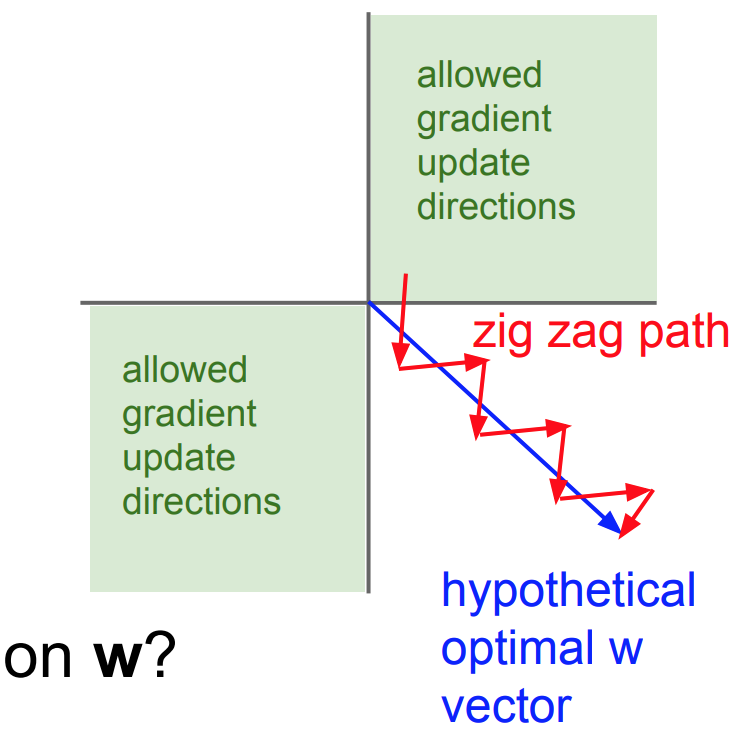

#### Downsides of the sigmoid activation function, and why you may want to center your inputs

This document seeks to provide some notes on why zero-centering inputs can be a good idea in machine learning, and some limitations of using the sigmoid function in your model. It is not necessarily a complete enumeration of all of the reasons, though.

##### Argument 1: If inputs are non-zero centered and sigmoid is used, saturation is a concern

Consider the sigmoid function:

We note that the gradient saturates as $$ \sigma(x) \rightarrow{} 1 $$or $$\sigma(x) \rightarrow{} 0$$. We can simply tell this by the slope of the function as these points are approached, and also compute the derivative. We know that $$ \sigma'(x) = \sigma(x)(1 - \sigma(x))$$, so $$ \sigma'(x) \rightarrow{} 0 $$ at these extreme values.

Therefore, if inputs are not zero-centered and the sigmoid is used, saturation will be more likely than if our inputs *were* zero-centered. 

Saturation implies that the gradients will be $$ 0 $$ (or close to it), but early on in learning, we generally want larger gradients, since our error is high. This can drastically slow down learning. Since zero-centering the data will bring the inputs of the sigmoid away from where they can saturate, zero-centering could increase the gradient signal during the early stages of learning, providing for faster learning.

##### Argument 2: If inputs are not zero-centered or sigmoid is used, then gradient descent updates become less effective due to "zig zag" learning

The range of sigmoid is given by $$ 0 < \sigma(x) < 1 $$, namely, it is always a positive value. Consider what happens when an input layer receives input $$ x = [x_1, x_2, …] $$ where all $$ x_i > 0 $$:

$$ y = f(\sum_i w_ix_i) $$ 

We have $$ \frac{dy}{dw_i} = f'(\sum_i w_i x_i)x_i$$ , therefore, all the gradient updates will either be all positive or all negative, so the weights will move in the same direction(the weight updates being given by $$ w_i \leftarrow{} w_i - \alpha \frac{dy}{dw_i}$$) . This results in the gradient updates taking on a "zig-zag" path, which is less efficient than if the optimal direction was directly followed:

(Image taken from the [CS 231n lecture slides](http://cs231n.stanford.edu/slides/2017/cs231n_2017_lecture6.pdf))

Furthermore, if $$ f $$ is a sigmoid function, then all our weight updates will always be all positive. Generally, this isn't a prohibitive concern, since even when the inputs are *not* zero-centered and the neural network is composed of several layers, learning still occurs, albeit at a slow rate - this is because the input has at least *some* negative values.

A fix would be to use an activation function $$ f $$ that is not always positive, such as the tanh or relu activations. Another fix would be to normalize the data, so that half the inputs are less than zero and half are greater.

